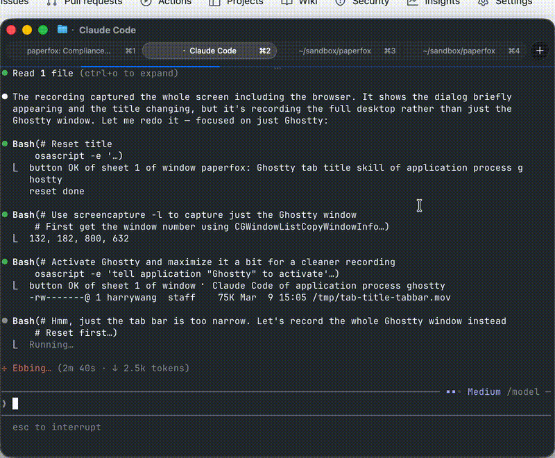

# Ghostty Tab Title Skill

An [agent skill](https://agentskills.io) that sets your [Ghostty](https://ghostty.org) terminal tab title based on what you're working on.

Works with Claude Code, Cursor, Windsurf, and other AI coding agents that support the Agent Skills standard.



## Install

```bash
npx skills add harrywang/ghostty-tab-title
```

## What it does

When you run `/tab-title`, the skill:

1. Summarizes your current session in 3-6 words
2. Sets the Ghostty tab title using the format `folder: context`

For example: `paperfox: Fix auth bug in proxy`

This makes it easy to identify what each terminal tab is doing when you have multiple sessions open.

## How it works

Uses Ghostty's AppleScript API (added in v1.3) to programmatically set the tab title via the `prompt_tab_title` action. The title persists and overrides any automatic title updates.

## Requirements

- macOS (uses AppleScript)
- Ghostty 1.3+
- Accessibility permissions for System Events

## License

MIT
